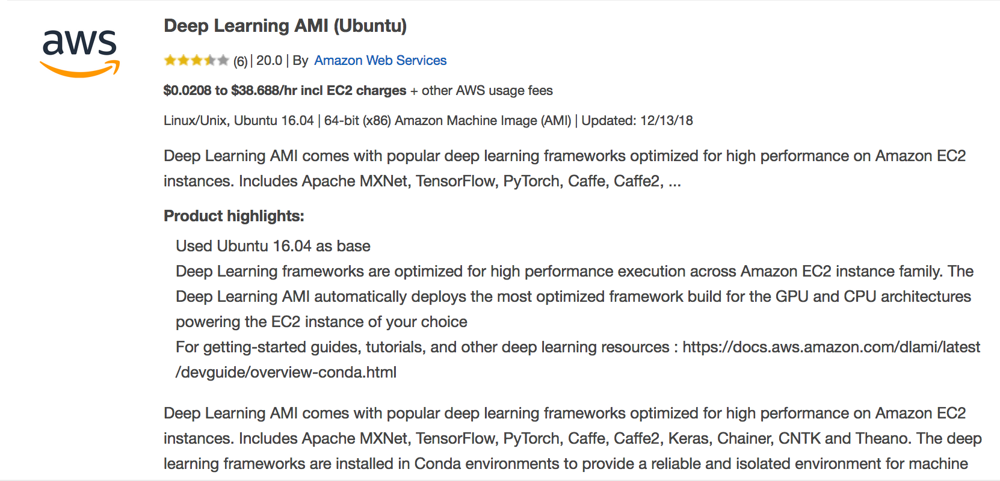

## Building Traffic Light Detector

This markdown explains how to setup and train an object detection model
by using TensorFlow Object Detection API.

### Contents

The contents of the folder `tl_detect` is as follows:

- `data`: The dataset needs to be put here by downloading from
the links given below. Some files for creating datasets are also included.
some files related to them (see `README.md` inside for further detail).
- `environment.yaml`: To create Anaconda environment to work to train a model
with CPU, outside the workspace (Tensorflow 1.4.0).
- `environment_gpu.yaml`: To create Anaconda environment to work to train a model
with GPU, outside the workspace (Tensorflow 1.4.0).
- `object_detection_sdc.ipynb`: This Jupyter notebook is for checking the
performance of trained models. This is based on
`models/research/object_detection/object_detection_tutorial.ipynb`
provided in the [original repo](https://github.com/tensorflow/models) for Tensorflow models
as well as Object Detection Lab of this course.
- `object_detection_sdc_extra_lib.ipynb`: This one is essentially the same
as `object_detection_sdc.ipynb` but requires extra libraries such as
`matplotlib` and something from `models/research/object_detection/utlis` folder
in the [original repo](https://github.com/tensorflow/models) for Tensorflow models.
- `test_performance.py`: The content of this Python file is the same as
that in `object_detection_sdc.ipynb`. This Python code can run on Udacity GPU
workspace.
- `training`: This folder is for training models.

<!-- - `training/model1`: This folder is for training models by starting with
the pre-trained model `faster_rcnn_inception_v2_coco_2017_11_08.tar.gz`
available at the [object detection model zoo](https://github.com/tensorflow/models/blob/69e1c50433c6cf7843a7cd337558efbb85656f07/research/object_detection/g3doc/detection_model_zoo.md). -->

The datasets for building traffic light detection models can be downloaded
from the links below:

- ROS bag dataset
  - [rosbag_data(training + validation)](https://drive.google.com/open?id=1DPBC9hYdNKK-df3R9-aFe9RLV3hcSFZd): Full data from the ROS bag video.
  New training and validation sets can be created from this dataset by using `train_val_generate.ipynb`.  
  - [rosbag_data_train](https://drive.google.com/open?id=1v7C44_lVsej3NDXe7XqUJISeXxNYWkDi): 80% of randomly selected data from the full ROS bag data
  with `train_val_generate.ipynb`. For training.
  - [rosbag_data_val](https://drive.google.com/open?id=1dMS-Ivtw3xtnZhq8aVHgJtI45SQ-ptoB): The rest of data (20%). For validation.

- BOSCH mini dataset
  - [bosch_mini_data(training + validation)](https://drive.google.com/open?id=1X2zsH4gw1nWlHneNvqJ3wpibGTsJ3QkD): Extracted and resized version of [BOSCH small traffic light dataset](https://hci.iwr.uni-heidelberg.de/node/6132). New training and validation sets can be created from this dataset by using `train_val_generate.ipynb`.  
  - [bosch_mini_data_train](https://drive.google.com/open?id=1OZGlo_08p2zA8LYwddWslJCoc7LKgXsb): 80% of randomly selected data from the full ROS bag data with `train_val_generate.ipynb`. For training.
  - [bosch_mini_data_val](https://drive.google.com/open?id=19xBRHdauD4MJ7wv0UJafJ3zgiw5vYwD6): The rest of data (20%). For validation.

- Simulator dataset (v1)
  - [sim_data(training + validation)](https://drive.google.com/open?id=1Wp2h4v-03iyccQWTNi86QOQjChmSQJil): Full data from recorded simulator videos. New training and validation sets can be created from this dataset by using `train_val_generate.ipynb`.  
  - [sim_data_train](https://drive.google.com/open?id=1LZrAC5Nb8VpyPYy2OtdUSw8aUr-6kuA7): 80% of randomly selected data from the full simulator data with `train_val_generate.ipynb`. For training.
  - [sim_data_val](https://drive.google.com/open?id=1XGthmZIG4WU90bUU4qb8Ysi1dyguDvR_): The rest of data (20%). For validation.

- Simulator dataset (v2, some images with small traffic lights only removed)
  - [v2_sim_data(training + validation)](https://drive.google.com/open?id=1pbw11tYZWGGC-wEDNdHBvfJUnR8xqy5B): Full data from recorded simulator videos.
  New training and validation sets can be created from this dataset by using `train_val_generate.ipynb`.  
  - [v2_sim_data_train](https://drive.google.com/open?id=1qCBN0W5a-Xxl6t9h6VOJ4FPD4ItkkExw): 80% of randomly selected data from the full simulator data
  with `train_val_generate.ipynb`. For training.
  - [v2_sim_data_val](https://drive.google.com/open?id=1VZ_wtj1tiKUVrF7P_sPu2FXaxLpqARBK): The rest of data (20%). For validation.

- Simulator dataset (v3, with higher quality images)
  - [v3_sim_data(training + validation)](https://drive.google.com/open?id=1aDybL-I0XeAIIBJ7oW2OBEgUkmgJ6ypF): Full data from recorded simulator videos. New training and validation sets can be created from this dataset by using `train_val_generate.ipynb`.  
  - [v3_sim_data_train](https://drive.google.com/open?id=1wxwH-OLAyqCjC-H5pP5-KL2wYgZzFGk8): 80% of randomly selected data from the full simulator data with `train_val_generate.ipynb`. For training.
  - [v3_sim_data_val](https://drive.google.com/open?id=1uoX6yWZPLuvEgoNsPwrVB-Cucoi9hcYG): The rest of data (20%). For validation.

The pre-trained models for object detection used can be downloaded from
the following links (Note that we are not using the latest version of the
TensorFlow model repository. See the instruction below):

- [pre-trained models](https://github.com/tensorflow/models/blob/69e1c50433c6cf7843a7cd337558efbb85656f07/research/object_detection/g3doc/detection_model_zoo.md)

- [configuration file](https://github.com/tensorflow/models/tree/69e1c50433c6cf7843a7cd337558efbb85656f07/research/object_detection/samples/configs)


For building other parts of this project, here we add some links to
download some models after training:

- [trained_model1](https://drive.google.com/open?id=12e6ycV7gESCvYIjQxgmpT5yXtg3M44VH)
  - pre-trained model: `faster_rcnn_inception_v2_coco_2017_11_08.tar.gz`
  - batch size 5, number of steps 10000
  - data for training: ROS bag dataset with 0.8:0.2 split

- [trained_model2](https://drive.google.com/open?id=1z217UpqzqNzj4qhWiTDk9Og8vJNIGOAG)
  - pre-trained model: `faster_rcnn_inception_v2_coco_2017_11_08.tar.gz`
  - batch size 10, number of steps 5000
  - data for training: v2 sim dataset with 0.8:0.2 split

- [trained_model3](https://drive.google.com/open?id=1uPqPhCpg4xYkql2HMBtgX-YR_17FLlcU)
  - pre-trained model: `ssd_inception_v2_coco_2017_11_17.tar.gz`
  - batch size 24, number of steps 20000
  - data for training: Bosch mini dataset + ROS bag dataset with 0.8:0.2 split

- [trained_model4](https://drive.google.com/open?id=1x-oo5m5JfXABM9vY3ZYho8wdvLIwCQPO)
  - pre-trained model: `ssd_inception_v2_coco_2017_11_17.tar.gz`
  - batch size 24, number of steps 10000
  - data for training: sim dataset with 0.8:0.2 split

- [trained_model5](https://drive.google.com/open?id=1SNH_i8_SDsncCnsm75lmFcjesvLkjzjM)
  - pre-trained model: `ssd_inception_v2_coco_2017_11_17.tar.gz`
  - batch size 48, number of steps 7000
  - data for training: v2 sim dataset + v3 sim dataset with 0.8:0.2 split

- [trained_model6](https://drive.google.com/open?id=18yo1Tmq9_w1zASa5V-KkACfcgRW1a6vw)
  - pre-trained model: `ssd_mobilenet_v1_coco_2017_11_17.tar.gz`
  - batch size 24, number of steps 12000
  - data for training: sim dataset + v2 sim dataset + v3 sim dataset with 0.8:0.2 split

- [trained_model7](https://drive.google.com/open?id=1DoQg3OU6Xl4iS7rUh8YkGmClFQH7wnxl)
  - pre-trained model: `ssd_mobilenet_v1_coco_2017_11_17.tar.gz`
  - batch size 24, number of steps 12000
  - data for training: v2 sim dataset + v3 sim dataset with 0.8:0.2 split

- [trained_model8](https://drive.google.com/open?id=1Wx2m--evijNHwHeuoic3o5reg8tKHV92)
  - pre-trained model: `ssd_mobilenet_v1_coco_2017_11_17.tar.gz`
  - batch size 24, number of steps 20000
  - data for training: Bosch mini dataset + ROS bag dataset with 0.8:0.2 split


### For Training on Local Machine, Outside Udacity Workspace

When working outside the Udacity Workspace for training,
create an environment with Anaconda:
- For CPU:
```
conda env create -f environment.yaml python=2.7
```
and activate
```
source activate carnd-capstone
```
- For GPU:
```
conda env create -f environment_gpu.yaml python=2.7
```
and activate
```
source activate carnd-capstone-gpu
```

In case one wants to use on Jupyter notebook, use
```
ipython kernel install --user --name carnd-capstone
```
and choose this kernel when using Jupyter notebook.
(If you want, for the consistency of the naming,
replace `carnd-capstone` by `carnd-capstone-gpu` for the case with GPU.)

**NOTE THAT THIS ENVIRONMENT IS ONLY FOR TRAINING A MODEL**.
Some libraries are different versions than those in `requirements.txt`
of [CarND-Capstone repository](https://github.com/udacity/CarND-Capstone).
Some are not included there.
Please check if the performance of the trained model is
fine on the Udacity Workspace. Also note that the libraries
included in Udacity Workspace with CPU only are different
from those in the Workspace with CPU+GPU. In the end,
the check the performance of the trained model (and, before that if
it works for the object detection or not) on the Udacity Workspace.

### Setup
The setup before training the model is as follows:

1. Clone the original repository for TensorFlow models:
```
git clone https://github.com/tensorflow/models
```

2. Select an old version (Tensorflow 1.4.0 but the generated file is compatible with
with Tensorflow 1.3.0) by using the following command:
```
cd models
git checkout 69e1c50
```
The website of this version is available
[here](https://github.com/tensorflow/models/tree/69e1c50433c6cf7843a7cd337558efbb85656f07).
This version is released in the end of 2017.

3. Follow the [original instruction](https://github.com/tensorflow/models/blob/69e1c50433c6cf7843a7cd337558efbb85656f07/research/object_detection/g3doc/installation.md) to install some dependencies and setup.

4. Put the folder `tl_detect` inside `models/research`

5. Download a pre-trained model and its configuration file from the abov links.
(In the following we assume that we have downloaded the pre-trained model file
`faster_rcnn_inception_v2_coco_2017_11_08.tar.gz` and
the configuration file `faster_rcnn_inception_v2_coco.config`).

  <!-- - [pretrained models](https://github.com/tensorflow/models/blob/69e1c50433c6cf7843a7cd337558efbb85656f07/research/object_detection/g3doc/detection_model_zoo.md)
  - [configuration file](https://github.com/tensorflow/models/tree/69e1c50433c6cf7843a7cd337558efbb85656f07/research/object_detection/samples/configs) -->

5. Create a new folder (here we call `model1`) at `tl_detect/training`
and move `faster_rcnn_inception_v2_coco.config` to `tl_detect/training/model1`.
Also create an empty folder with name `trained_model` there.

6. Unzip the tar.gz file and move the generated folder
(`faster_rcnn_inception_v2_coco_2017_11_08` here) to `tl_detect/training/model1`.

7. Edit the configuration file `faster_rcnn_inception_v2_coco.config`.
The following items must be edited (For the rest of the parameters,
tune as you like. Here we assume that the ROS bag data is used):

  - `num_classes`: set to `3` so that it matches with the numbers of classes
  in `data/label_map_sdc.pbtxt`.
  - `fine_tune_checkpoint`: set to  `"tl_detect/training/model1/faster_rcnn_inception_v2_coco_2017_11_08/model.ckpt"`
  - `input_path` inside `train_input_reader`: set to the path to TFRecord file for training i.e. ``"tl_detect/data/rosbag_data_train/rosbag_data_train.record"``
  - `label_map_path` inside `train_input_reader`: set to the path to `label_map_sdc.pbtxt`, i.e.
  ``"tl_detect/data/label_map_sdc.pbtxt"``
  - `input_path` inside `eval_input_reader`: set to the path to TFRecord file for validation, i.e. ``"tl_detect/data/rosbag_data_val/rosbag_data_val.record"``
  - `label_map_path` inside `eval_input_reader`: set to the path to `label_map_sdc.pbtxt`, i.e.
  ``"tl_detect/data/label_map_sdc.pbtxt"``


### Training
For training, take the following steps:

1. Move to `models/research` and run
```
protoc object_detection/protos/*.proto --python_out=.
export PYTHONPATH=$PYTHONPATH:`pwd`:`pwd`/slim
```

2. Command for training
```
MODEL_NAME=model1
CONFIG_FILE=faster_rcnn_inception_v2_coco.config
PATH_TO_MODEL_DIR=tl_detect/training/${MODEL_NAME}
python object_detection/train.py
--logtostderr
--train_dir=${PATH_TO_MODEL_DIR}
--pipeline_config_path=${PATH_TO_MODEL_DIR}/${CONFIG_FILE}
```

<!-- 3. Open a new terminal, move to `models/research` and run
(`MODEL_NAME`, `CONFIG_FILE` and `PATH_TO_MODEL_DIR` must be
the same as the previous step)
```
export PYTHONPATH=$PYTHONPATH:`pwd`:`pwd`/slim
MODEL_NAME=model1
CONFIG_FILE=faster_rcnn_inception_v2_coco.config
PATH_TO_MODEL_DIR=tl_detect/training/${MODEL_NAME}
tensorboard --logdir='${PATH_TO_MODEL_DIR}'
```
Then access to the instructed page and monitor
the training process. -->

3. Once training is done, select one of the model check points
stored in `${PATH_TO_MODEL_DIR}` (here we take `model.ckpt-10`)
and use the following command to
create a graph file for the trained model.
```
CHECK_POINT=model.ckpt-10
python object_detection/export_inference_graph.py
--input_type=image_tensor
--pipeline_config_path=${PATH_TO_MODEL_DIR}/${CONFIG_FILE}
--trained_checkpoint_prefix=${PATH_TO_MODEL_DIR}/${CHECK_POINT}
--output_directory=${PATH_TO_MODEL_DIR}/trained_model/
```
A trained model is saved in `${PATH_TO_MODEL_DIR}/trained_model`.


4. To see the performance of the trained model,
open `object_detection_sdc.ipynb` at `models/research/tl_detect/`,
```
jupyter notebook object_detection_sdc.ipynb
```
edit `MODEL_NAME` (for the current case, set `MODEL_NAME='training/model1/trained_model'`)
and execute the cells. The test images are stored in `tl_detect/data/test_images`.
If you want to use more test images, add extra images to this folder
and edit `PATH_TO_TEST_IMAGES_DIR` and `TEST_IMAGE_PATHS` appropriately
in the Jupyter notebook.

In case one want to do the same thing without using Jupyter notebook,
run `test_performance.py` at  `models/research/tl_detect/` instead
(the code is exactly the same):
```
python test_performance.py
```
This `test_perfomrance.py` is designed such that it can run
on Udacity Workspace with and without GPU.


Depending on which pre-trained model and dataset to use,
change the paths in the `.config` file and `MODEL_NAME`, `CONFIG_FILE`
and `PATH_TO_MODEL_DIR`.


### For Training on AWS GPU Instance
To train on a GPU instance of AWS,
the following is one way to setup for our purpose:

1. Select AMI named "Deep Learning AMI (Ubuntu)" from AWS market place.

This AMI includes CUDA 8 (the default setup
for TensorFlow is CUDA 9) and Anaconda.

2. Choose the instance type. `p2.xlarge` (with NVIDIA K80) or faster recommended.

3. Launch the instance (select security group, storage size as you like)
and ssh into the instance from your local machine.

4. Change to CUDA 8 by following the instruction in the [official document](https://docs.aws.amazon.com/dlami/latest/devguide/dlami-dg.pdf)
(page 25, "Configuring CUDA Versions"):
```
sudo rm /usr/local/cuda
sudo ln -s /usr/local/cuda-8.0 /usr/local/cuda
```
You can check if the change is valid by running
```
cd /usr/local/cuda/samples/1_Utilities/deviceQuery
sudo make
./deviceQuery
```
Also you can check the version of CUDA by running
```
nvcc --version
```


5. Clone TensorFlow repo and choose an old version:
```
git clone https://github.com/tensorflow/models
cd models
git checkout 69e1c50
```

6. Download `tl_detect` from the Dropbox link with
```
wget https://www.dropbox.com/s/4w0ayj32btfykjn/tl_detect.zip
```
Unzip and move `tl_detect` folder to the directory `/models/research/`

7. Use `environment_gpu.yaml` file to configure the environment with
```
conda env create -f environment_gpu.yaml python=2.7
```
and activate with
```
source activate carnd-capstone-gpu
```
You can check the versions of Python and TensorFlow by executing
```
python
import tensorflow as tf
tf.VERSION
```

### Note

- In case of errors, here are some hints based on my experience:
  - After moving to `/models/research`, set path as
  ```
  export PYTHONPATH=$PYTHONPATH:`pwd`:`pwd`/slim
  ```
  <!-- - Update `protobuf` (Protocol Buffer by Google Developers). -->

- In the GPU environment of Udacity Workspace, `protobuf` is not installed
(while it is installed in CPU environment...). So, it is impossible
to train with Object Detection API there. But to run a trained
model seems to be possible (one can run `test_performance.py` there).
Also, `matplotlib` is not installed there...

- In the GPU environment of Udacity Workspace, `tensorflow===1.3.0`
and `pillow==2.2.1` are used.

- To keep training even when ssh connection to AWS terminates, use
the following command when submitting a job:
```
nohup python [filename, options etc.] &  
```
Then the output to the terminal are written to `nohup.out` file.
To kill the job, first run
```
ps -ef | grep python
```
and find the ID for the job (I think the leftmost number located in the
item corresponding to the job) and run
```
kill [job ID]
```

- One way to access to tensorboard through AWS is as follows:
  - First make the 8080 port available for TCP connection. (Set in the security group).
  - Then run (assuming that the model config files etc. are located at `tl_detect/training/model1`)
  ```
  tensorboard --logdir=tl_detect/training/model1 --host=0.0.0.0 --port=8080
  ```
  - Then with a web browser, access to `[external IP of instance]:8080`.

<!-- - The version of TensorFlow must be `tensorflow>=1.9.0`. -->

- A general explanation on the conversion to TFRecord and use of the converted
data to object detection:
  - [Racoon Detector](https://towardsdatascience.com/how-to-train-your-own-object-detector-with-tensorflows-object-detector-api-bec72ecfe1d9)
  - [Peach Detector](https://medium.com/practical-deep-learning/a-complete-transfer-learning-toolchain-for-semantic-segmentation-3892d722b604)
  - [Dog Detector](http://androidkt.com/train-object-detection/)

- [Data augmentation with configuration file](https://github.com/tensorflow/models/blob/a4944a57ad2811e1f6a7a87589a9fc8a776e8d3c/object_detection/builders/preprocessor_builder.py)

- [Official Object Detection API Tutorial](https://tensorflow-object-detection-api-tutorial.readthedocs.io/en/latest/training.html)
